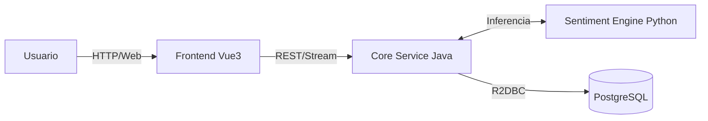

# 🌊 CesiumFlow: Sentiment Intelligence Platform

> **Orquestador reactivo Full-Stack para análisis de sentimientos e inteligencia de feedback.**


## 🎯 Visión General

**CesiumFlow** no es otro analizador de texto monolítico. Es un ecosistema de microservicios distribuido diseñado para transformar feedback no estructurado en activos de datos accionables.

A diferencia de las arquitecturas tradicionales que se ahogan bajo carga, CesiumFlow implementa un **stack reactivo híbrido**. El sistema ingesta grandes volúmenes de opiniones, delega el procesamiento pesado a un motor de inferencia dedicado y visualiza tendencias en tiempo real sin latencia perceptible.

### 🏛️ Arquitectura y Stack Técnico

El sistema opera bajo un patrón estricto de **Microservicios Orquestados**. Cada componente tiene una responsabilidad única y un contrato de interfaz claro.

| Componente | Tecnología Principal | Puerto | Responsabilidad |
| :--- | :--- | :--- | :--- |
| **Frontend (Edge)** | Vue 3 + Vite (Node 24) | `5173` | UI reactiva, carga de datasets y dashboard de métricas en tiempo real. |
| **Core Service** | Java 17 + Spring Boot 3.5 | `8080` | Orquestación reactiva (WebFlux), validación y gestión de transacciones. |
| **Sentiment Engine** | Python 3.14 + FastAPI | `5000` | Inferencia ML (Scikit-learn) y procesamiento NLP de alto rendimiento. |
| **Persistence** | PostgreSQL 15-alpine | `5432` | Almacenamiento relacional y vistas materializadas para analítica. |

#### Flujo de Datos Simplificado




## 🛠️ Prerrequisitos de Infraestructura

Para levantar este clúster, no negociamos con el entorno. Necesitas lo siguiente:

1.  [**Docker Desktop**](https://www.docker.com/products/docker-desktop/): El motor de ejecución. **Debe estar corriendo.**
2.  **Puertos Libres:** Asegúrate de que nadie esté ocupando el `8080`, `5173`, `5000` o `5432` en tu máquina.
3.  **Git Bash / WSL2 (Windows):** Si estás en Windows, usa una terminal decente. CMD/PowerShell pueden dar problemas con scripts de shell.

### ⚡ Herramientas de Productividad (Recomendado)
Para no perder tiempo escribiendo comandos largos de Docker, usamos **Just**:
-   [**Just (Task Runner)**](https://github.com/casey/just#installation): Abstracción de comandos operativos.

---

## 🚀 Guía de Despliegue (Quick Start)

Sigue este protocolo estrictamente para evitar inconsistencias de entorno.

### 1. Clonar el repositorio

```bash
git clone [https://github.com/cesiumflow/sentiment-api.git](https://github.com/cesiumflow/sentiment-api.git)
cd sentiment-api
```

### 2. Configurar el entorno
El sistema necesita inyección de secretos. Copia la plantilla base (el .env real está en .gitignore por seguridad).

```bash
cp .env.example .env
```

### 3. Lanzar el ecosistema
   Tenemos dos vías de despliegue. Elige la que corresponda a tu necesidad.

Opción A: Vía Rápida (Recomendada con `just`)
Si instalaste `just`, levanta todo el entorno de desarrollo con hot-reload activo:

```bash
just dev
# Esto equivale a: docker compose up -d --build
```

### Opción B: Vía Manual (Docker Compose)
Si prefieres hacerlo manualmente o necesitas simular producción:

```bash
# Entorno de Desarrollo (Hot-Reload, Debugging)
docker compose up -d --build

# Entorno de Producción (Artefactos compilados, Nginx, optimizado)
docker compose -f docker-compose.yml up -d --build
```

### 4. Validación de Servicios
   Una vez que los contenedores estén estables, verifica los puntos de entrada:

-   🖥️ Aplicación Web: http://localhost:5173 (o puerto 80 en modo prod)

-   📚 Swagger API Docs: http://localhost:8080/swagger-ui.html

-   ⚙️ Health Check: http://localhost:8080/actuator/health


## ⚙️ Operaciones y Comandos (Justfile)

Centralizamos la complejidad operativa en el `Justfile`. Usen estos comandos para mantener el ciclo de vida del software.

| Comando | Acción Real | Justificación Técnica |
| :--- | :--- | :--- |
| `just dev` | `up -d --build` | Inicializa el clúster completo sincronizando código fuente. |
| `just logs` | `logs -f` | Stream unificado de telemetría de todos los servicios. |
| `just clean` | `down --rmi -v` | **Purga total**. Borra contenedores, volúmenes y caché. Útil si corrompes la BD. |
| `just reset-docker` | `prune + rm` | Hard reset. Úsese solo en caso de colisiones de red críticas. |

> [!IMPORTANT]
> **Usuarios de Windows:**
> Asegúrense de que su editor (VS Code/IntelliJ) use finales de línea **LF** y no CRLF. Los scripts de shell dentro de los contenedores Linux fallarán si detectan caracteres de retorno de carro de Windows.

---

## 📂 Estructura del Proyecto

Arquitectura políglota desacoplada. No mezclen lógica de dominio con lógica de presentación.

```text
.
├── frontend/              # SPA en Vue 3 + Vite
│   ├── src/               # Componentes y Stores (Pinia)
│   └── Dockerfile         # Construcción de imagen Node/Nginx
├── core-service/          # Backend Java (Spring Boot + R2DBC)
│   ├── src/               # Lógica de dominio y API REST
│   └── pom.xml            # Dependencias Maven
├── data-science/          # Engine Python (FastAPI + Scikit-learn)
│   ├── models/            # Modelos serializados (.joblib)
│   └── src/               # Pipeline de inferencia NLP
├── db/                    # Infraestructura de datos
│   └── init.sql           # Esquemas iniciales SQL
├── docker-compose.yml     # Orquestador de topología de red
└── Justfile               # Automatización operativa
```

## 🔧 Extensibilidad y Mantenimiento
### Actualización del Modelo de IA
El servicio de Python es independiente. Si el equipo de Data Science mejora el modelo:

1.  Entrenar el modelo y generar los nuevos `.joblib`.

2.  Reemplazar los archivos en `data-science/models/`.

3.  Actualizar `requirements.txt` si cambiaron las versiones de `scikit-learn`.

4.  Ejecutar `just dev` para reconstruir el contenedor de inferencia.

### Agregar Nuevos Microservicios
1.  Crear directorio del servicio (ej: `notification-service`).

2.  Añadir su `Dockerfile`.

3.  Registrarlo en `docker-compose.yml` dentro de la red `default`.

### ⚠️ Troubleshooting (Solución de Problemas)
**Error: "Port is already allocated" (5432 / 8080)** Si Docker falla al iniciar, tienes un proceso "zombie" o un servicio local (como un Postgres instalado en Windows) robando el puerto.

**Solución (Git Bash / Terminal con Admin):**

```bash
# 1. Identificar el proceso invasor
netstat -ano | findstr :5432

# 2. Matar el proceso (Reemplaza 1234 con el PID que obtuviste)
taskkill //F //PID 1234
```
## Squad 55 - CesiumFlow Project
