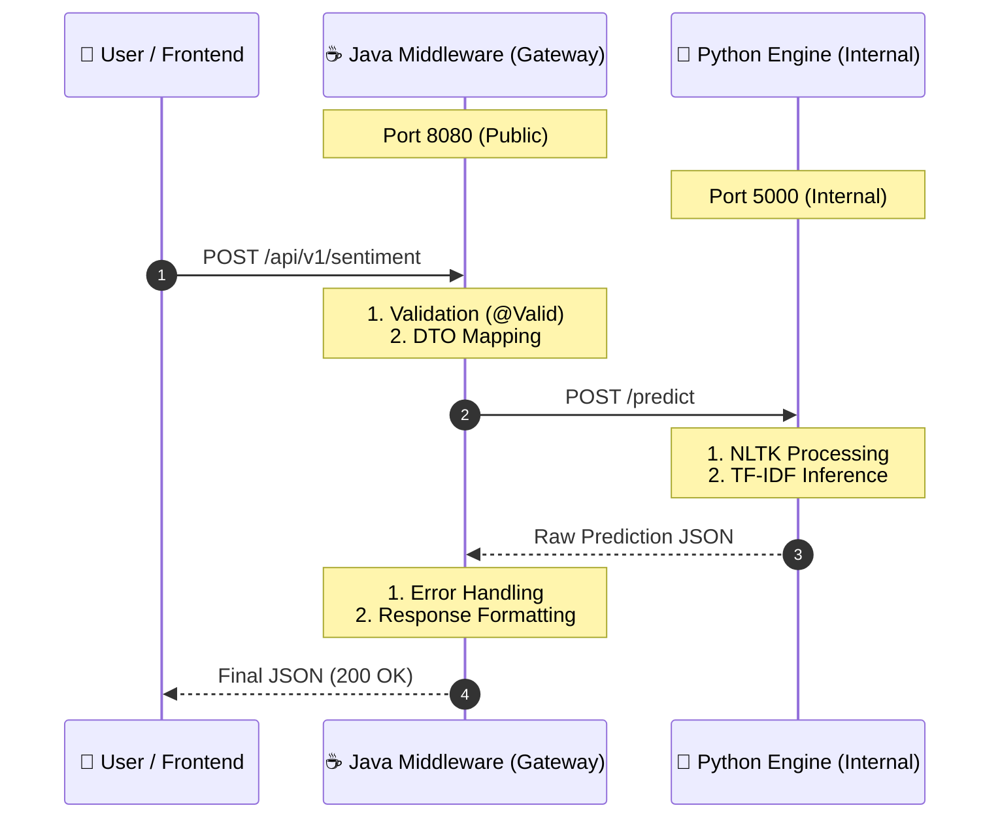

# 📜 API Interface Contract (API Specification) - Squad 55

| Metadata         | Details                                               |
| :--------------- | :---------------------------------------------------- |
| **Version**      | **1.1.0-dev**                                         |
| **Status**       | 🚧 **In Development / Pending Review**                |
| **Architecture** | **Middleware Pattern** (Java Gateway ↔ Python Engine) |
| **Teams**        | Data Science (Python) ↔ Back-End (Java)               |

## 🧠 Architectural Flow

This diagram represents the "Happy Path" data flow. Note how **Java acts as a Middleware**, sanitizing input before it reaches the core inference engine.



---

## 🎯 OBJECTIVE

This document defines the strict communication rules and business logic between:

1.  **Java Middleware (Public Layer):** Handles traffic, validation, security, and versioning.
2.  **Python Engine (Private Layer):** Dedicated exclusively to Machine Learning inference tasks.

---

## 🚀 Part 1: Public API (Java Middleware)

The interface consumed by the Frontend. It acts as the "Bouncer," ensuring no malformed data reaches the internal engine.

### Main Resource: Sentiment Analysis

- **URL:** `http://localhost:8080/api/v1/sentiment`
- **Method:** `POST`
- **Content-Type:** `application/json`

### 📥 Request Example (Input)

```json
{
    "text": "The service was excellent and arrived very fast."
}
```

**Validation Rules (Java Bean Validation):**

1.  `text`: **@NotBlank** (Must not be null or empty).
2.  `text`: **@Size(min=3, max=5000)** (Length constraints).
3.  **Encoding:** UTF-8 required (Must support special characters like `ñ`, `ü`).

### 📤 Response Example (200 OK)

```json
{
    "prediction": "Positivo",
    "probability": 0.92,
    "keywords": ["excelente", "rápido", "servicio"],
    "timestamp": "2025-12-29T10:00:00Z"
}
```

**Data Dictionary:**
| Field | Type | Description |
| :--- | :--- | :--- |
| `prediction` | `String` | Model label: `"Positivo"`, `"Negativo"`, `"Neutro"`. |
| `probability` | `Float` | Model confidence score (0.00 to 1.00). |
| `keywords` | `List<String>` | Tokens filtered by NLTK + Business Blacklist. |
| `timestamp` | `String` | ISO 8601 timestamp of the processing time. |

---

### ⚠️ Public Error Handling

Standard HTTP codes returned to the user when business rules are violated.

#### 🔴 Error 400: Bad Request

Triggered automatically by the Middleware when validation fails (e.g., text too short).

```json
{
    "timestamp": "2025-12-29T10:05:00Z",
    "status": 400,
    "error": "Bad Request",
    "path": "/api/v1/sentiment"
}
```

#### 🔥 Error 500: Internal Service Failure

Triggered if the internal Python engine is unreachable. The Middleware catches the exception to prevent a system crash.

```json
{
    "prediction": "CONNECTION_ERROR",
    "probability": 0.0,
    "keywords": [],
    "timestamp": null
}
```

---

## 🔌 Part 2: Internal API (Python Engine)

This API is **private**. External users cannot access port `5000` directly.

### Internal Resource: Inference

- **Internal Service:** `http://sentiment-engine:5000`
- **Path:** `/predict` (MLOps Standard)
- **Method:** `POST`

### 📥 Internal Request (Java → Python)

The Java Middleware forwards the sanitized text.

```json
{
    "text": "El servicio fue excelente y llegó muy rápido."
}
```

### 📤 Internal Response (Python → Java)

The Python Engine returns raw calculation data.

```json
{
    "prediction": "Positivo",
    "probability": 0.92341,
    "keywords": ["excelente", "rápido"],
    "timestamp": "..."
}
```

---

## 🩺 DevOps & Health Checks

Endpoints designed for Container Orchestration (Docker) and Integration Testing.

| Component  | Method | Endpoint               | Type            | Purpose                                             |
| :--------- | :----- | :--------------------- | :-------------- | :-------------------------------------------------- |
| **Java**   | `GET`  | `/`                    | **Liveness**    | Confirms the Middleware container is running.       |
| **Java**   | `GET`  | `/api/v1/test?text=ok` | **Integration** | Tests the full pipeline (Java ↔ Python connection). |
| **Python** | `GET`  | `/`                    | **Liveness**    | Confirms FastAPI loaded the NLTK data and Model.    |
